# 02: System Architecture & Fault-Isolation Blueprint

This document specifies the technical architecture, directory structure, data flows, and blast-radius containment mechanisms of the **UB Platform**.

---

## 1. System Overview & Monorepo Topology

The UB Platform is structured as an enterprise-grade **Turborepo Monorepo** managed with `pnpm`.

```text
UB Platform (Turborepo)
├── apps/
│   ├── web/                    # Next.js 15 (App Router, ISR, Edge CDN) -> upgraderboy.com
│   ├── admin/                  # Next.js / Vite SPA (Dedicated CMS) -> admin.upgraderboy.com
│   └── mobile/                 # React Native / Expo Router (iOS & Android App)
│
├── packages/
│   ├── types/                  # Single source of truth for TypeScript types & Zod schemas
│   ├── ui/                     # Design tokens, primitives, theme system, kinetic components
│   ├── api/                    # Shared data access layer, database SDK clients, fetchers
│   ├── config/                 # Shared configs (ESLint, Prettier, Tailwind, TSConfig)
│   └── utils/                  # Shared helper functions (formatters, dates, markdown)
│
└── docs/                       # Living architectural & operational documentation
```

---

## 2. Fault-Isolation Architecture (Zero Cascading Outages)

```mermaid
flowchart TD
    subgraph EdgeCDN["Edge CDN Layer (Vercel / Cloudflare)"]
        WEB_EDGE["apps/web (upgraderboy.com)<br/>Cached Static & ISR Pages"]
    end

    subgraph DedicatedInstances["Isolated Server Instances"]
        ADMIN_APP["apps/admin (admin.upgraderboy.com)<br/>Private Admin Dashboard"]
        MOBILE_CLIENT["apps/mobile (iOS / Android)<br/>Native Client with Offline Cache"]
        AI_EDGE["AI Copilot Worker<br/>Isolated Serverless Route"]
    end

    subgraph DataPlane["Data Plane (Supabase / Firebase)"]
        DB[("PostgreSQL / Firestore")]
        AUTH["Auth Service"]
        STORAGE[("Object Storage (PDFs/Images)")]
    end

    WEB_EDGE -.->|Revalidates in Background| DB
    ADMIN_APP -->|Mutates Data| DB
    ADMIN_APP -->|Uploads Assets| STORAGE
    MOBILE_CLIENT -.->|Queries & Caches Offline| DB
    AI_EDGE -.->|Queries Context| DB

    style WEB_EDGE fill:#0d2818,stroke:#04e762,stroke-width:2px
    style ADMIN_APP fill:#2b1055,stroke:#9d4edd,stroke-width:2px
    style MOBILE_CLIENT fill:#1f2937,stroke:#60a5fa,stroke-width:2px
```



### Blast-Radius Containment Rules:
1. **Total Physical Separation:** `apps/web` and `apps/admin` run as completely isolated services on separate subdomains.
2. **Crash Resilience:** If `apps/admin` crashes (e.g. out of memory during a huge PDF upload or an unhandled exception), `apps/web` experiences **zero downtime**.
3. **ISR Caching Shield:** The public website compiles pages into static HTML at build time and revalidates via ISR (Incremental Static Regeneration). Even during a total database outage, the public website continues serving cached pages instantly from the Edge CDN.
4. **React Error Boundaries (`error.tsx`):** Every major feature (Terminal, PDF Viewer, Blog comments, AI Copilot) is wrapped in an isolated boundary so a local component error never results in a global blank screen.

---

## 3. Package Dependency Matrix

| Package | Can Import From | Used By |
| :--- | :--- | :--- |
| `packages/types` | None (pure schemas & types) | `packages/api`, `packages/ui`, `apps/*` |
| `packages/utils` | `packages/types` | `packages/api`, `packages/ui`, `apps/*` |
| `packages/ui` | `packages/types`, `packages/utils` | `apps/web`, `apps/admin`, `apps/mobile` |
| `packages/api` | `packages/types`, `packages/utils` | `apps/web`, `apps/admin`, `apps/mobile` |
| `apps/web` | `packages/*` | Public Users |
| `apps/admin` | `packages/*` | Administrators |
| `apps/mobile` | `packages/*` | Mobile App Users |

> **Prohibited:** No `app` is ever allowed to import directly from another `app`. All shared code must be lifted to `packages/*`.
