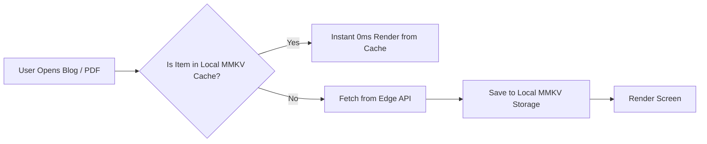

# 11: Mobile Application Architecture & Offline Sync

This document defines the React Native / Expo architecture for **`apps/mobile`**, including the navigation hierarchy, offline data caching, and native hardware integration.

---

## 1. Native Navigation Hierarchy (Expo Router)

```text
apps/mobile/app/
├── (tabs)/
│   ├── _layout.tsx             # Bottom tab bar with blurred glass background
│   ├── index.tsx               # Home tab (Hero, quick stats, featured work)
│   ├── projects.tsx            # Projects tab (Case studies & categories)
│   ├── blogs.tsx               # Blogs tab (Reading feed)
│   ├── resources.tsx           # Study materials & folder hierarchy
│   └── profile.tsx             # About, credentials, resume download
│
├── project/[slug].tsx          # Native case study view
├── blog/[slug].tsx             # Native distraction-free blog reader
├── pdf-viewer.tsx              # Native PDF reader with offline caching
└── _layout.tsx                 # Root layout with shared theme provider
```

---

## 2. Offline-First Caching Strategy

Students and technical readers often need to access study materials, DSA notes, and blogs on the go without steady internet.



* **Storage Engine:** `react-native-mmkv` (fast, synchronous C++ key-value store, 30x faster than `AsyncStorage`).
* **Offline PDF Storage:** Downloaded study notes are saved locally to `expo-file-system` document storage for zero-connectivity reading.

---

## 3. Shared Design Tokens Integration

The mobile app imports exact color tokens, typography scales, and spacing values from `@ub/ui`:
* Uses **NativeWind (Tailwind CSS for React Native)** or direct token-bound `StyleSheet.create`.
* Guarantees that button styles, dark background colors (`#07090e`), and cyber accents (`#00f0ff`) match the web application with 100% fidelity.
